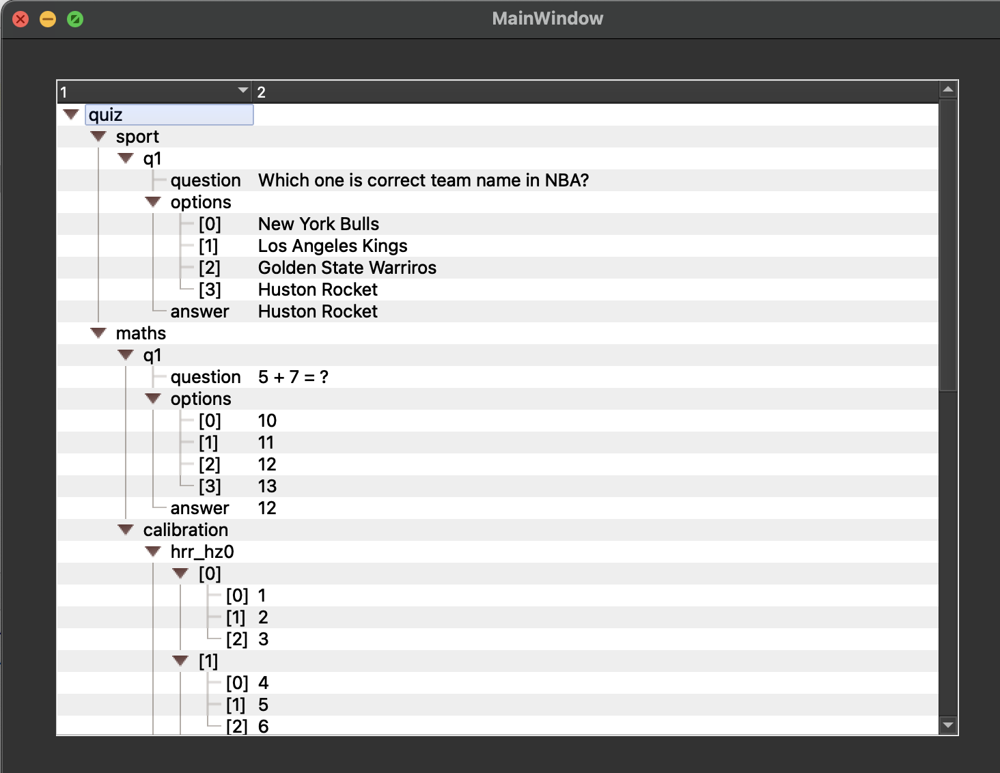

# jsonview
Example Python Program to display json in a QTreeView
[jsontree.py](jasontree.py)

Features that are evaluated:
* Qt6 QTreeView and data model
* display branch lines (non-obvious solution)
* load data from json file and auto populate
* show values in second column
* autoadjust tree width (first column)
* alternating row color

